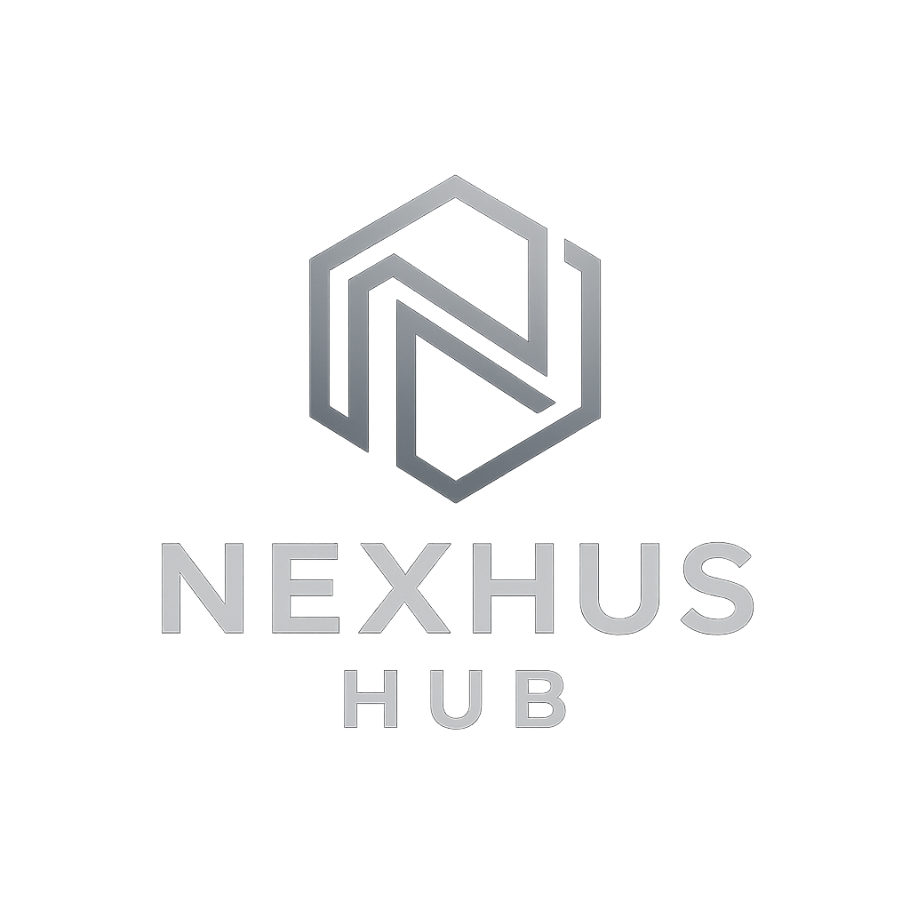

# NexusHub

<div align="center">
  
  
  **Unifying Your Digital World: Commerce, Property, & Connections**
  
  Experience the next generation of integrated digital platforms combining Real Estate, E-co### 🤝 **Networking Module**
- **Social Feed**: Connect with cool and fun people
- **Activity Groups**: Join exciting hobby and interest groups
- **Fun Events**: Discover local events and social gatherings
- **Shared Interests**: Find people with similar hobbies and passions
- **Community Building**: Create lasting friendships and connections
- **Real-time Interactions**: Live feed with latest activities and Professional Networking, powered by Sensay AI.
  
  [](https://nexushub.social)
  [](https://reactjs.org/)
  [](https://vitejs.dev/)
  [](LICENSE)
</div>

## 🌟 Overview

NexusHub is a revolutionary unified digital platform that seamlessly integrates three essential aspects of modern digital life:

- **🏠 Real Estate Listings** - Browse and discover properties with AI-powered recommendations
- **🛍️ E-commerce Catalog** - Shop from a curated selection of products across multiple categories
- **🎉 Fun Social Networking** - Connect with cool and fun people, join hobby groups, and discover exciting social activities and events

All powered by **Sensay AI** - an intelligent assistant that enhances every aspect of your experience with personalized recommendations, automated task management, and seamless cross-platform integration.

## ✨ Key Features

### 🔐 **Authentication & Security**
- Google OAuth integration for secure login
- Persistent authentication state
- Protected routes and conditional navigation
- User session management

### 🏠 **Real Estate Module**
- Property listings with high-quality images
- Advanced filtering (price, location, beds, baths)
- Agent profiles with contact information
- Interactive property cards with favorites
- Responsive grid/list view toggle

### 🛍️ **E-commerce Module**
- Product catalog with actual product images
- Smart categorization (Trending, New Arrivals, Bestsellers)
- Advanced search and filtering
- Shopping cart functionality
- Product reviews and ratings

### 🎉 **Fun Social Networking Module**
- Social feed for connecting with amazing people who share your interests
- Create and share posts about your hobbies, adventures, and fun experiences
- Join activity groups based on shared interests and passions
- Discover local events, meetups, and social gatherings
- Find people with similar hobbies for friendship and fun activities
- Real-time interactions and community engagement

### 🤖 **AI-Powered Assistant**
- Real-time chat with Sensay AI API
- Context-aware responses
- Multi-module support
- Intelligent recommendations
- Natural language processing

### 📱 **Mobile-First Design**
- Fully responsive across all devices
- Mobile navigation with hamburger menu
- Touch-optimized interactions
- Progressive Web App features
- Bottom navigation for mobile

## 🚀 Quick Start

### Prerequisites

Before you begin, ensure you have the following installed:
- **Node.js** (v18.0.0 or higher)
- **npm** (v9.0.0 or higher) or **yarn**
- **Git**

### Installation

1. **Clone the repository**
   ```bash
   git clone https://github.com/abdussalam-mustapha/NexusHub.git
   cd NexusHub
   ```

2. **Install dependencies**
   ```bash
   npm install
   # or
   yarn install
   ```

3. **Set up environment variables**
   
   Create a `.env` file in the root directory:
   ```bash
   cp .env.example .env
   ```
   
   Add your API keys to `.env`:
   ```env
   # Google OAuth Configuration
   VITE_GOOGLE_CLIENT_ID=your_google_client_id_here
   
   # Sensay AI Configuration
   VITE_X_ORGANIZATION_SECRET=your_sensay_org_secret
   VITE_SENSAY_QUERY_API_URL=https://api.sensay.io/v1/replicas/your_replica_id/chat/completions
   VITE_X_USER_ID=your_sensay_user_id
   VITE_X_API_VERSION=2025-03-25
   ```

4. **Start the development server**
   ```bash
   npm run dev
   # or
   yarn dev
   ```

5. **Open your browser**
   
   Navigate to `http://localhost:5173` to see the application running.

## 🛠️ Configuration

### Google OAuth Setup

1. Go to the [Google Cloud Console](https://console.cloud.google.com/)
2. Create a new project or select an existing one
3. Enable the Google+ API
4. Create OAuth 2.0 credentials
5. Add your domain to authorized origins
6. Copy the Client ID to your `.env` file

### Sensay AI Integration

1. Sign up for a [Sensay AI account](https://sensay.io)
2. Create a new AI replica
3. Get your API credentials from the dashboard
4. Configure the environment variables with your credentials

## 📁 Project Structure

```
NexusHub/
├── public/                 # Static assets
│   └── vite.svg
├── src/
│   ├── assets/            # Images and static files
│   │   ├── ava1.png
│   │   ├── ava2.png
│   │   ├── ava3.png
│   │   ├── code.png
│   │   ├── NexusHub.png
│   │   ├── property*.jpg
│   │   └── product images...
│   ├── components/        # React components
│   │   ├── screens/       # Main application screens
│   │   │   ├── EcommerceCatalog.jsx
│   │   │   ├── NetworkingFeed.jsx
│   │   │   └── RealEstateListings.jsx
│   │   ├── shared/        # Reusable components
│   │   │   ├── ChatBot.jsx
│   │   │   ├── Sidebar.jsx
│   │   │   └── TopNav.jsx
│   │   ├── Authentication.jsx
│   │   ├── LandingPage.jsx
│   │   └── ProtectedRoute.jsx
│   ├── contexts/          # React contexts
│   │   └── AuthContext.jsx
│   ├── App.jsx           # Main app component
│   ├── main.jsx          # Entry point
│   └── index.css         # Global styles
├── .env                  # Environment variables
├── package.json          # Dependencies and scripts
├── vite.config.js        # Vite configuration
└── README.md            # This file
```

## 🎨 Tech Stack

### Frontend
- **React 19.1.1** - Modern React with hooks and context
- **Vite 7.1.3** - Fast build tool and dev server
- **React Router DOM** - Client-side routing
- **Lucide React** - Beautiful icon library
- **CSS3** - Custom styling with responsive design

### Authentication
- **@react-oauth/google** - Google OAuth integration
- **JWT Decode** - Token handling and validation

### AI Integration
- **Sensay AI API** - Real-time AI chat capabilities
- **REST API** - HTTP client for API communication

### Development Tools
- **ESLint** - Code linting and formatting
- **PostCSS** - CSS processing
- **Git** - Version control

## 🌐 Deployment

### Production Build

1. **Build the application**
   ```bash
   npm run build
   # or
   yarn build
   ```

2. **Preview the build**
   ```bash
   npm run preview
   # or
   yarn preview
   ```

### Deployment Options

#### Vercel (Recommended)
1. Connect your GitHub repository to Vercel
2. Add environment variables in Vercel dashboard
3. Deploy with automatic CI/CD

#### Netlify
1. Connect your GitHub repository to Netlify
2. Set build command: `npm run build`
3. Set publish directory: `dist`
4. Add environment variables

#### Traditional Hosting
1. Build the project: `npm run build`
2. Upload the `dist` folder to your web server
3. Configure your server to serve the index.html for all routes

## 🔧 Available Scripts

```bash
# Development
npm run dev          # Start development server
npm run build        # Build for production
npm run preview      # Preview production build locally

# Code Quality
npm run lint         # Run ESLint
npm run lint:fix     # Fix ESLint errors automatically

# Dependencies
npm install          # Install dependencies
npm update           # Update dependencies
```

## 🌟 Features in Detail

### Real Estate Module
- **Property Listings**: Browse properties with detailed information
- **High-Quality Images**: Professional property photography
- **Advanced Filters**: Filter by price, location, bedrooms, bathrooms
- **Agent Profiles**: Connect with real estate professionals
- **Favorites**: Save properties for later viewing
- **Responsive Views**: Grid and list view options

### E-commerce Module
- **Product Catalog**: Extensive collection of products
- **Smart Categories**: Trending, New Arrivals, Top Bestsellers
- **Product Images**: High-resolution product photography
- **Search & Filter**: Find products quickly and efficiently
- **Product Details**: Comprehensive product information
- **Wishlist**: Save products for future purchase

### Fun Social Networking Module
- **Social Feed**: Connect with cool and fun people who share your interests
- **Activity Groups**: Join exciting hobby and interest groups (gaming, sports, arts, music, etc.)
- **Fun Events**: Discover local social events, meetups, and gatherings
- **Shared Interests**: Find people with similar hobbies and passions for friendship
- **Community Building**: Create lasting friendships through shared activities
- **Adventure Sharing**: Share your fun experiences, adventures, and memorable moments
- **Real-time Interactions**: Live feed with latest activities and social updates

### AI Assistant
- **Contextual Understanding**: AI understands your current module
- **Smart Recommendations**: Personalized suggestions
- **Natural Conversations**: Human-like interaction
- **Multi-language Support**: Communicate in your preferred language
- **Learning Capability**: AI improves with each interaction

## 🔒 Security & Privacy

- **Secure Authentication**: OAuth 2.0 with Google
- **Data Protection**: Encrypted data transmission
- **Privacy First**: User data handled with care
- **Secure API**: Protected endpoints with authentication
- **Session Management**: Secure user session handling

## 📱 Mobile Experience

NexusHub is designed mobile-first with:
- **Responsive Design**: Adapts to any screen size
- **Touch Optimization**: Finger-friendly interactions
- **Mobile Navigation**: Hamburger menu and bottom navigation
- **Fast Loading**: Optimized for mobile networks
- **PWA Features**: Install as a mobile app

## 🤝 Contributing

We welcome contributions! Please see our [Contributing Guidelines](CONTRIBUTING.md) for details.

1. Fork the repository
2. Create your feature branch (`git checkout -b feature/AmazingFeature`)
3. Commit your changes (`git commit -m 'Add some AmazingFeature'`)
4. Push to the branch (`git push origin feature/AmazingFeature`)
5. Open a Pull Request

## 📄 License

This project is licensed under the MIT License - see the [LICENSE](LICENSE) file for details.

## 🆘 Support

If you need help or have questions:

- **Documentation**: Check this README and inline comments
- **Issues**: Create a GitHub issue for bugs or feature requests
- **Discussions**: Use GitHub Discussions for questions
- **Email**: Contact the development team

## 🙏 Acknowledgments

- **Sensay AI** for providing advanced AI capabilities
- **Google** for OAuth authentication services
- **Lucide** for beautiful icons
- **React Team** for the amazing framework
- **Vite Team** for the fast build tool
- **Contributors** who help improve NexusHub

## 📊 Project Stats

- **Components**: 15+ React components
- **Features**: 20+ major features
- **API Integrations**: Google OAuth, Sensay AI
- **Mobile Responsive**: 100% mobile-friendly
- **Performance**: Optimized for speed and efficiency

---

<div align="center">
  
  **Built with ❤️ by the NexusHub Team**
  
  [Live Demo](https://nexushub.social) • [Documentation](README.md) • [Support](mailto:support@nexushub.social)
  
</div>
